## **Let’s try a Dataset in Gephi (Hands-on activity)**

For this activity we will be following Miriam Posner's Gephi tutorial.

We will be using a data set that comes pre-loaded in most Gephi installations. If you do not see this file, please <a href="/gephi-palladio/les-mis.gexf" download>download it here</a>.

 - _Les Miserables: coappearance weighted network of characters in the novel Les Miserables_. D. E. Knuth, The Stanford GraphBase: A Platform for Combinatorial Computing, Addison-Wesley, Reading, MA (1993).

## Getting Started: Download a network file

- Download the .gefx file

- Save this file in a folder you will remember (or create a folder specially for this small project).

## Description of the file / the network

This file contains a network representing "who appears next to whom" in the 19th century novel _Les Misérables_ by Victor Hugo.

- A link between characters **A** and **B** means they appeared on the same page or paragraph in the novel.

- Note: a file name ends with ".gexf" means this is a text file where the network information is stored (name of the characters, their relations, etc.), following some conventions.

## Open the network in Gephi

- Open Gephi. On the Welcome screen that appears, click on Open Graph File

- Find miserables.gexf on your computer and open it

## Read the report after opening a file

A report window will open, giving you basic info on the network you opened:

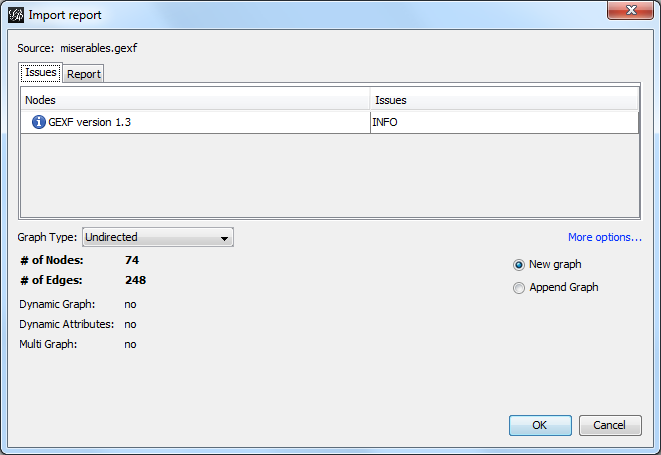

_This tells us a few things:_

- the network comprises **74** characters, and they're all connected by **248** links.

- Links are **undirected**, meaning that if A is connected to B, then it is the same as B connected to A.

- The report also tells us the graph is **not dynamic**: it means there is no evolution or chronology, it won’t "move in time".

- Click on **OK** to see the graph in Gephi.

## Initial view

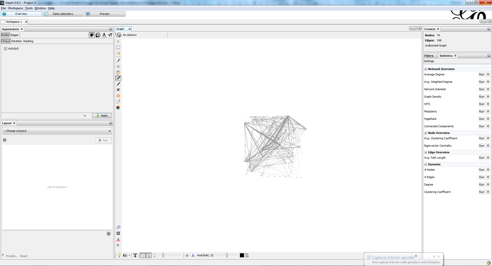

This is how the network appears in Gephi.  It doesn't look very useful (yet)...    

Mac users may not see a visualization yet. To remedy this go to "Window" in Gephi's main menu bar at the top of the screen and select "Graph from the Window menu.
{: .note}

## Basic view of Gephi’s interface

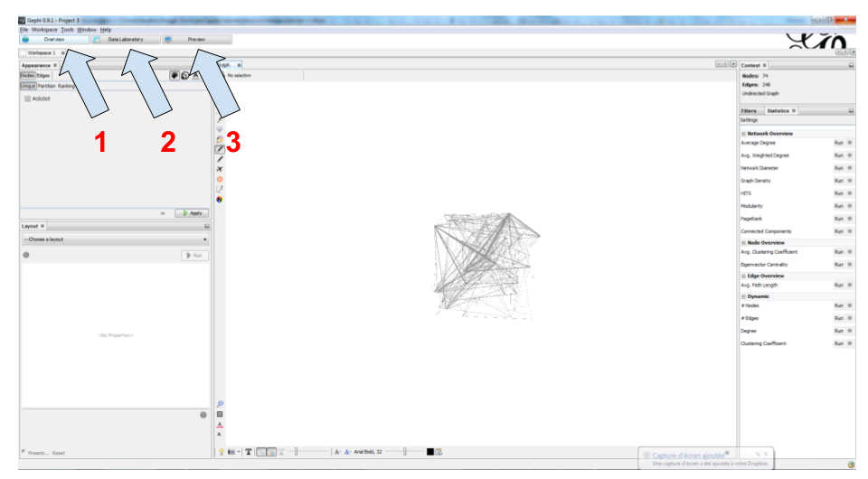

Gephi has 3 main screens:

**1. Overview:**where we can explore the graph visually

**2. Data Laboratory:** provides an "Excel" table view of the data in network

**3. Preview:** where we polish the visualization before exporting it as a pictue or pdf

What we see here is the Overview.

In the Overview, the graph is shown at the center. Around it, several panels help us fine tune the visualization.

**4. "Filters"**- we can hide different parts of the network under a variety of conditions

**5. "Statistics"** - we can compute metrics on the network

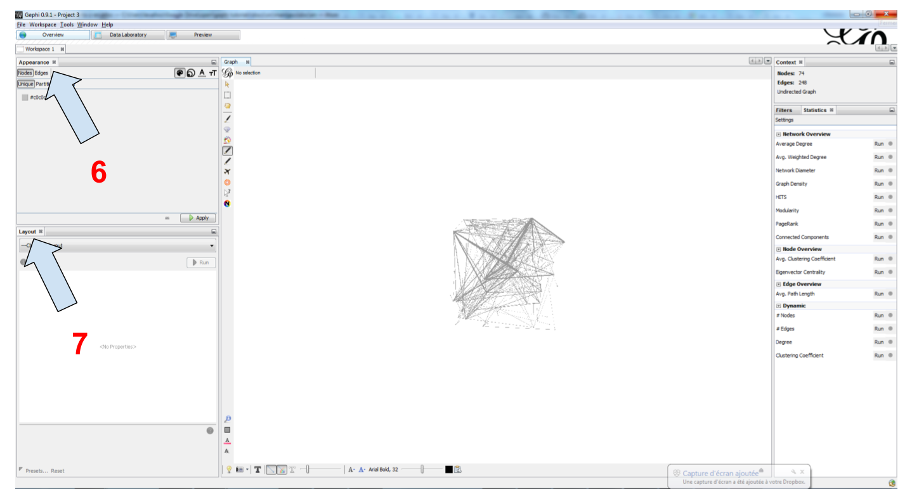

**6.  "Appearance"** - we can change colors and sizes in interesting ways

**7. "Layouts" -** we can apply automated procedures to change the position of the network

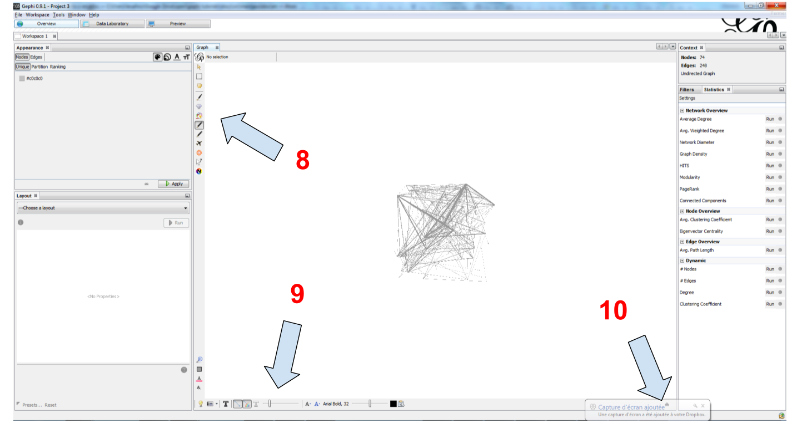

**8. A series of icons** - to add / colorize nodes and links manually, by clicking on them

**9. Options and sliders** - to change the size of all nodes, links, or labels

**10. More options** - become visible if we click on this little arrow head pointing up

## Showing labels of the nodes

## Layout ("spatialize") the network
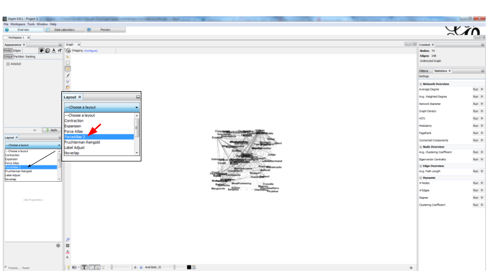

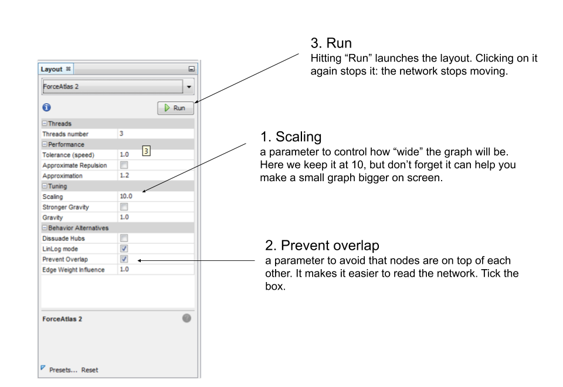

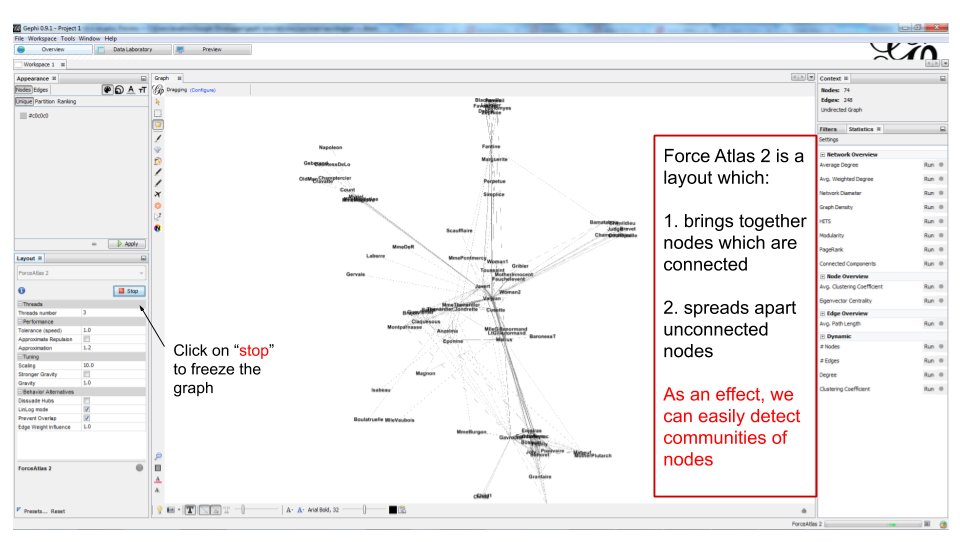

## Visualize the properties of the nodes

A network consists in entities and their relations. This is what we just visualized. Yet, the properties of these entities remain invisible.

For instance: the characters in the novel "Les Misérables" are male or female. Are males more likely to be connected to males, or females? Just looking at the network in Gephi, we can’t tell.

Now, we will see how to make this property ("Gender") visible.

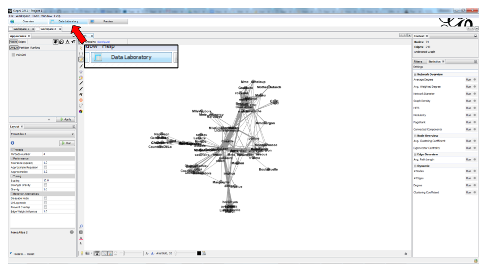

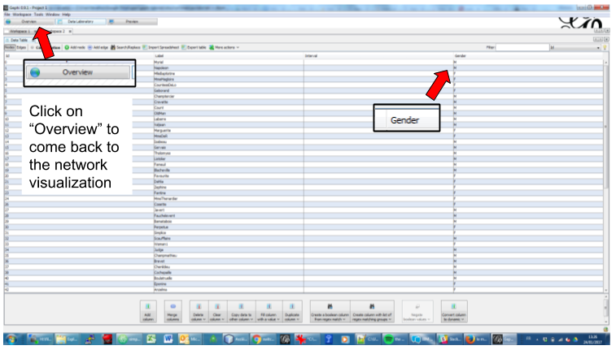

We will color the nodes based on their gender. To do that, we select Gender in the Appearance panel:

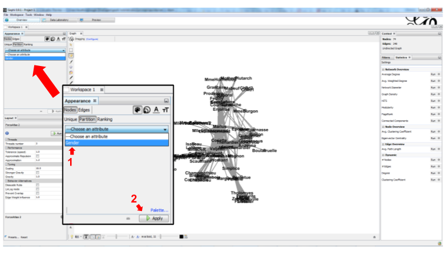

This is what it should look like!

